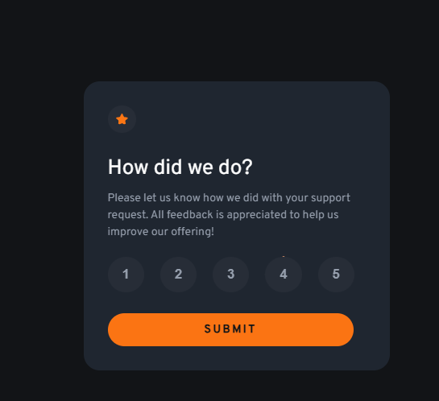
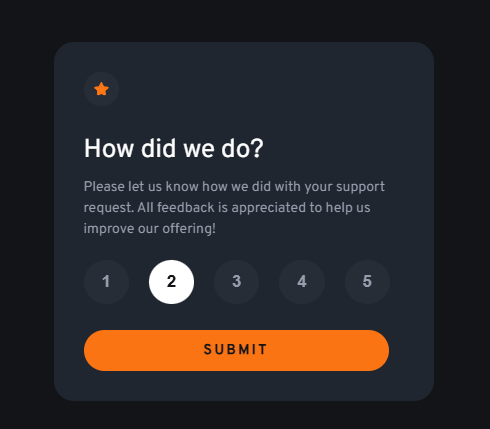

# Frontend Mentor - Interactive rating component solution

This is a solution to the [Interactive rating component challenge on Frontend Mentor](https://www.frontendmentor.io/challenges/interactive-rating-component-koxpeBUmI). Frontend Mentor challenges help you improve your coding skills by building realistic projects.

## Table of contents

- [Overview](#overview)
  - [The challenge](#the-challenge)
  - [Screenshot](#screenshot)
  - [Links](#links)
- [My process](#my-process)

  - [Built with](#built-with)
  - [What I learned](#what-i-learned)

- [Author](#author)

## Overview

### The challenge

Users should be able to:

- View the optimal layout for the app depending on their device's screen size
- See hover states for all interactive elements on the page
- Select and submit a number rating
- See the "Thank you" card state after submitting a rating

### Screenshot





### Links

- Solution URL: [Add solution URL here](https://github.com/dunt21/interactive-rating-component-main)
- Live Site URL: [Add live site URL here](https:interactive-rating-component-main-chi-lemon.vercel.app/)

## My process

### Built with

- Semantic HTML5 markup
- Javascript
- CSS
- Mobile-first workflow

### What I learned

Use this section to recap over some of your major learnings while working through this project. Writing these out and providing code samples of areas you want to highlight is a great way to reinforce your own knowledge.

To see how you can add code snippets, see below:

```html
<h1>Some HTML code I'm proud of</h1>
```

```js
const optionSelected = document.querySelector(".optionSelected");
optionSelected.textContent = optionSelected.textContent.replace(
  "4",
  selectedBtn.textContent
); this code here is simply used to replace the value 4 with the particular value of the option the user selected. this was possible with the help of string methods.
```

## Author

- Website - [Macaulay Suad Esinam](https://my-portfolio-mu-dun-46.vercel.app/#contact)
- Frontend Mentor - [@dunt21](https://www.frontendmentor.io/profile/dunt21)
- Twitter - [@moreofababe](https://x.com/moreofababe)
